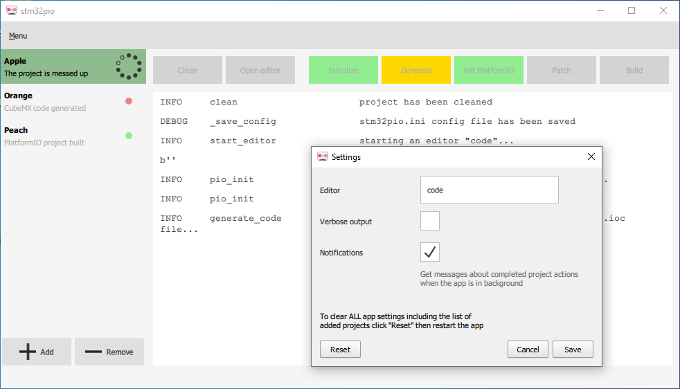
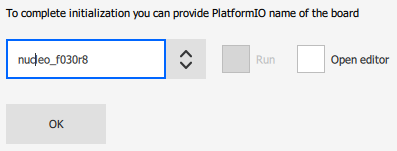

# stm32pio GUI



The cross-platform GUI version of the stm32pio. It wraps the core library functionality into the Qt5-QML skin using the PySide2 (aka "Qt for Python") and adds a projects' management feature allowing you to store and manipulate on multiple stm32pio projects at one place.


## Table of contents
> - [Install and run](#install-and-run)
> - [Usage](#usage)
> - [Architecture notes](#architecture-notes)


## Install and run
The app requires PySide2 of versions 5.14.2.3 or 5.15.2+ (early 5.15 versions has a bug making the Add/Remove buttons not active (https://bugreports.qt.io/browse/QTBUG-85130)) package. It should be available in all major package managers including pip, apt, brew and so on.

The convenient way to install is via `pip` specifying `extras` option:
```shell script
$ pip install stm32pio[GUI]
```

If you have installed the basic CLI version, the GUI package is already on your machine, so you can reinstall it using the command above or just supplement the existing setup installing the PySide2 manually.

Then it can be started from anywhere as
```shell script
$ stm32pio gui  # or
$ stm32pio_gui
```

If you rather want to launch completely from sources, it is possible like this:
```shell script
$ python path/to/stm32pio/gui/app.py
```
or
```shell script
stm32pio-repo/ $   python -m stm32pio.gui
```

Either way, you can additionally specify the project (and board ID) to start with:
```shell script
$ stm32pio gui -d ./sample-project -b discovery_f4
```


## Usage
Add a folder with an `.ioc` file to begin with - it will be your first project. You can either use the "Add" button or drag-and-drop it into the main window, in latter case you also have an ability to add multiple projects simultaneously. If a project is empty, the initialization screen will be shown to help in a configuration:



Skip it or enter one of the available PlatformIO STM32 boards identifier. Select "Run" to apply all actions to the project (analog of the `new` CLI command).

At the main screen the buttons row allows you to run specific actions while, at the same time, is representing the current state of project. Green color means that this stage is fulfilled. The active project is monitored automatically while all the others refreshes only when you click on them, so the "stage" line at the projects list item can be outdated.

Let's assume you've worked on some feature for some time (outside of the stm32pio) and now need to re-generate and rebuild the configuration. To schedule all the necessary actions to run one after another, navigate to the last desired action while pressing the **Shift** key. All the actions prior this one should be colored light-green now:


**Shift**-click on it to execute the series. The picked actions will be framed inside a bold border around each of them:


Add **Ctrl** to the mouse click to start the editor specified in the settings after the action (it can be combined with a **Shift** as well). **Hint:** specify the `start` as "Editor" command to open the project folder in the new Explorer window (for Windows), or `open` for the Finder (on macOS). So it is, basically, a generic shell script which can be activated post operations
```
<script> <project_path>
```

**Note:** Currently, the project config (`stm32pio.ini`) is not live-reloading, so any changes you make to it will not be reflected until a next program launch.


## Architecture notes

Projects list and settings are stored by `QSettings` so refer to its docs if you bother about the actual location.

Also, you can find the state machine diagram of the project action button (might be helpful if you're cracking the code).
