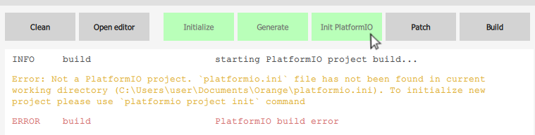

# stm32pio GUI


The cross-platform GUI version of the stm32pio. It wraps the core library functionality into the Qt-QML skin using the PySide2 (aka "Qt for Python" project) and adding the projects management feature allowing you to store and manipulate multiple stm32pio projects at one place.


## Installation

The app requires PySide2 5.12+ package (Qt 5.12 respectively). It is available in all major package managers including pip, apt, brew and so on.

The convenient way to install is via `pip` specifying `extras` option:
```shell script
$ pip install stm32pio[GUI]
```

Then it can be started as
```shell script
$ stm32pio_gui
```
from anywhere. If you have already installed the latest basic CLI version this script and sources are already on your machine so you can reinstall using the command above or to supplement the setup installing the PySide2 manually.

If you rather want to launch completely from the sources, currently it's possible only from the repository root point:
```shell script
stm32pio-repo/ $   python stm32pio_gui/app.py
```
or
```shell script
stm32pio-repo/ $   python -m stm32pio_gui
```


## Usage

Add a folder with the `.ioc` file to begin with. You can also drag-and-drop it into the main window, in this case you can add multiple projects simultaneously. If the project is empty the initialization screen will be shown to help in setup:


You can skip it or enter one of the available PlatformIO STM32 boards. Select "Run" to apply all actions to the project (analog of the `new` CLI command).

In the main screen the buttons row allows you to run specific actions while represents the state of the project at the same time. Green color means that this stage is fulfilled. The active project is monitored automatically while all the others refresh only when you click on them so the "stage" line at the projects list item can be outdated.

Let's assume you've worked on the project for some time and need to re-generate and rebuild the configuration. To schedule all the necessary actions to run one after another navigate to the last desired action pressing the Shift key. All the projects prior this one should be colored light-green now:



Shift-click on it to execute the series. The picked actions will be framed with border around each of them:


Add Ctrl to the mouse click to start the editor specified in the settings after the action. It can be combined with Shift. **Hint:** specify a `start` as an "Editor" command to open the folder in the new Explorer window under the Windows, `open` for the Finder on the macOS.


## Architecture notes

Projects list (not the projects themself) and settings are stored by `QSettings` so refer to its docs if you bother about the actual location.

See `docs` directory to see state machine diagram of the project action button.


## Known issues

The number of added projects that can be correctly represented is currently limited to about 5 due to some architectural mistakes. It's planned to be fixed in the near future.

Right after the removing of the project from the list there are several errors on the terminal appears. It is most likely caused by the non proper destruction order of components and isn't something to be worried about. By a similar reasons the app itself sometimes crushes during the shutdown process (doesn't observed on the macOS, though).
